# WebMusic
## Bài Tập Lớn Giữa Kỳ Môn Thiết Kế Web Nâng Cao

# Phần Mềm Quản Lý Và Thưởng Thức Nhạc

## Giới thiệu
 Phần mềm Quản Lý Nhạc là một ứng dụng web giúp quản lý danh sách bài hát một cách hiệu quả,
 bao gồm các chức năng như thêm, xóa, cập nhật và phát nhạc. Dự án hỗ trợ hiển thị danh sách bài
 hát, phát nhạc với giao diện cơ bản và cho phép điều chỉnh volume.

## Thành viên:
- Họ tên sinh viên: Phạm Đức Tài - Mã SV: 23010379

## Chức năng chính:
 - Thêm bài hát mới
 - Cập nhật thông tin bài hát (tiêu đề, nghệ sĩ, thể loại)
 - Xóa bài hát
 - Phát nhạc với giao diện chuyên nghiệp
 - Hiển thị danh sách bài hát
## UML
## 1.Sơ đồ thuật toán
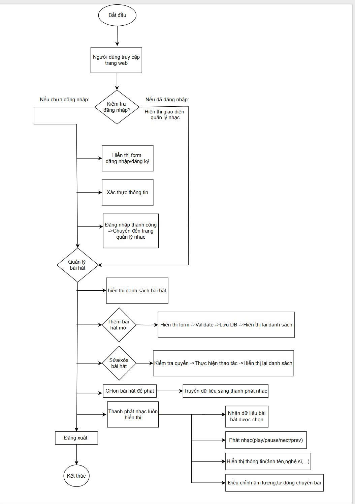
## 2.Sơ đồ cấu trúc
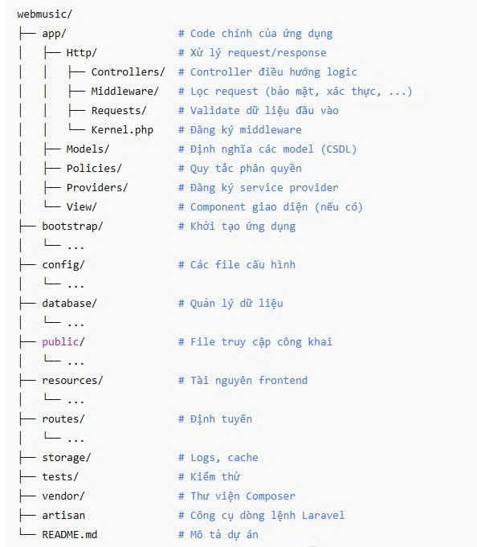
## 3. Ảnh chụp màn hình chức năng chính
###  3.1.Bắt đầu
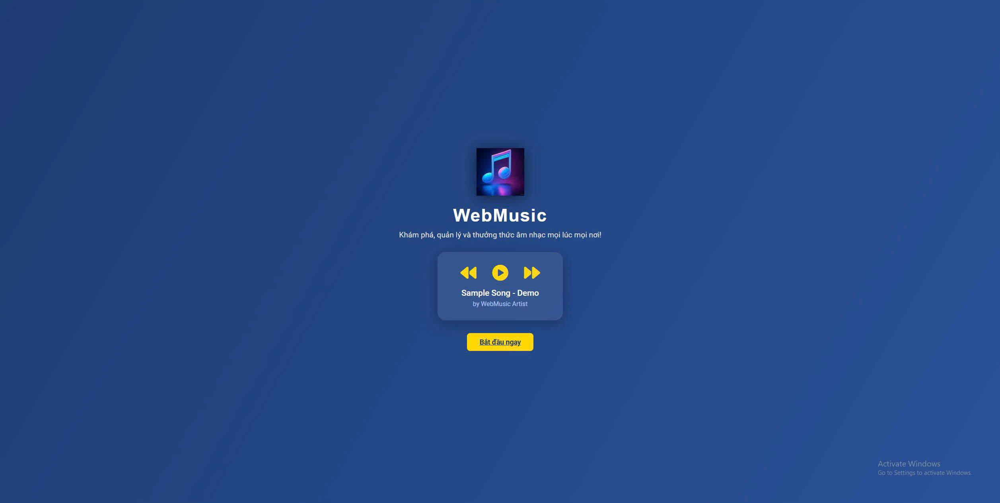
###   3.2.Đăng nhập
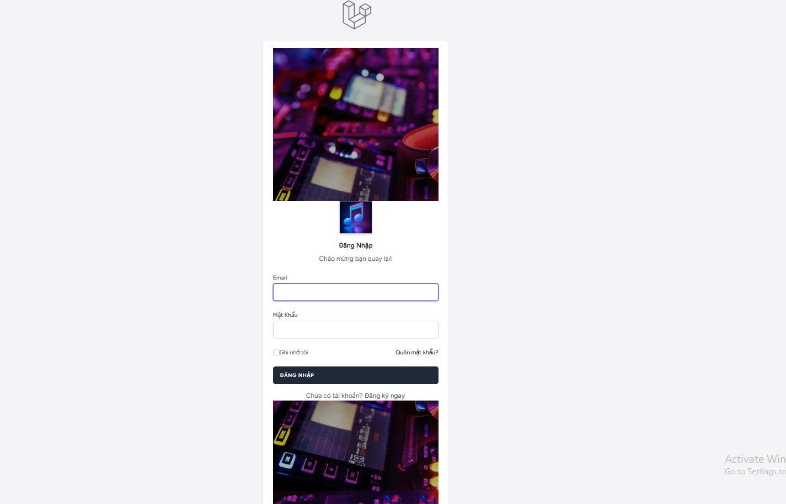
###  3.3.Đăng ký
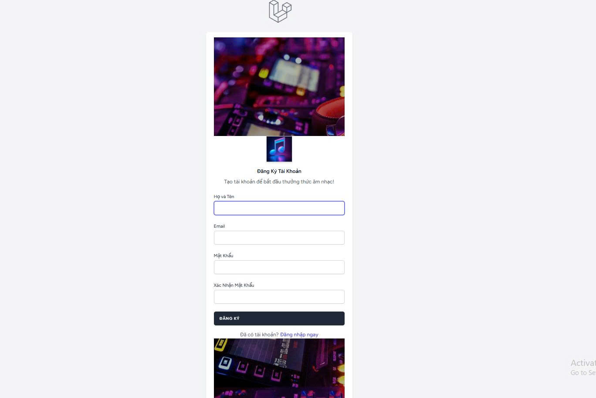
###  3.4.Quên mật khẩu
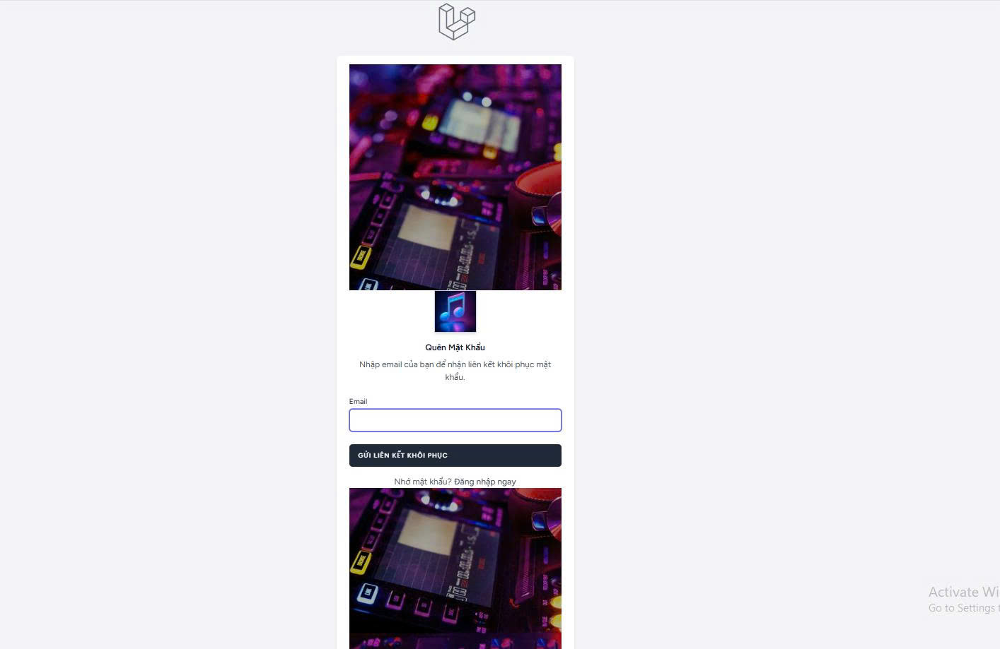
###  3.5.Giao diện quản lý nhạc sau khi đăng nhập
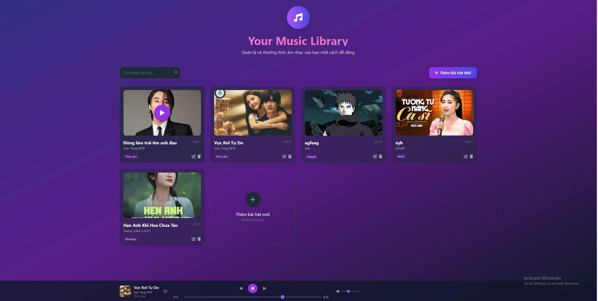
###   3.6.Thêm nhạc vào danh sách
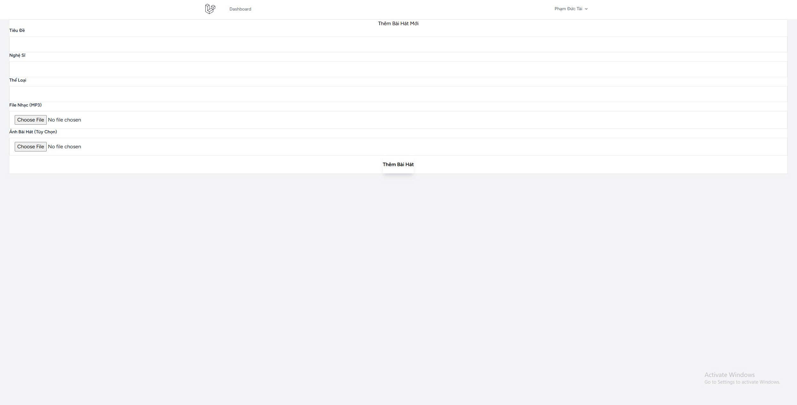
###   3.7.Sửa thông tin bài hát
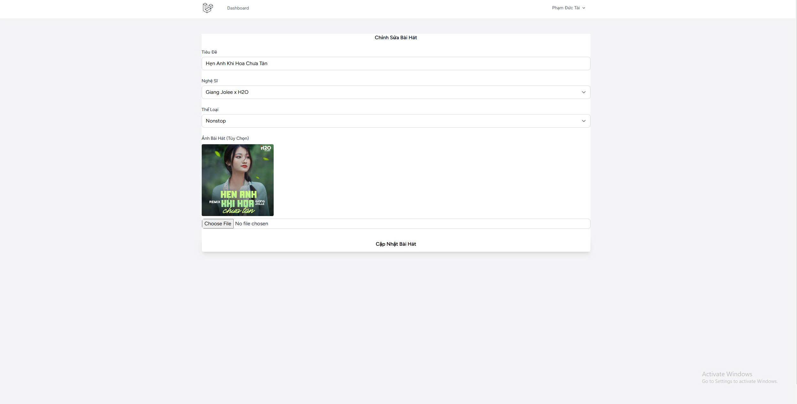
###   3.8.Xóa bài hát
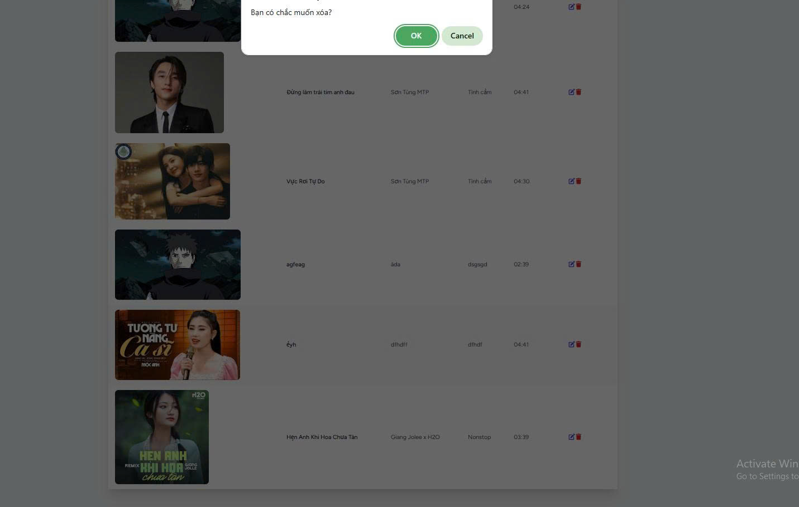
##  4.Code minh họa phần chính
###  4.1.Song.php
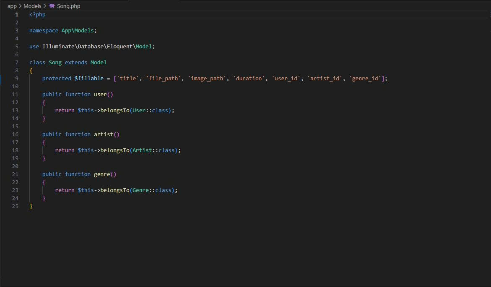
###  4.2.User.php
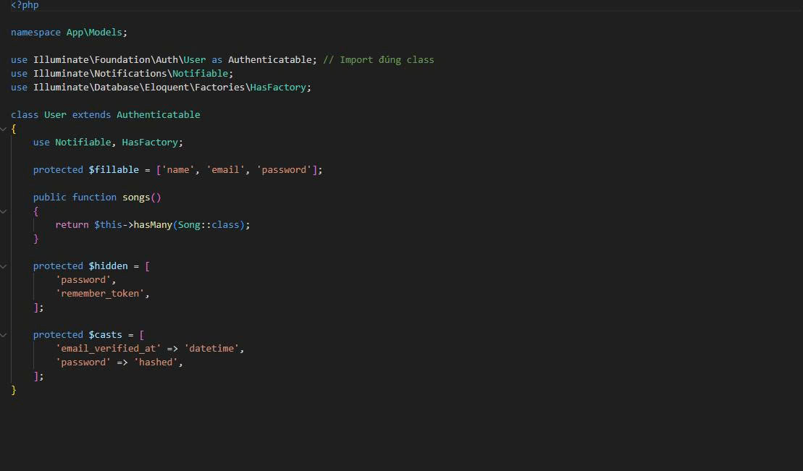
###  4.3.Artist.php
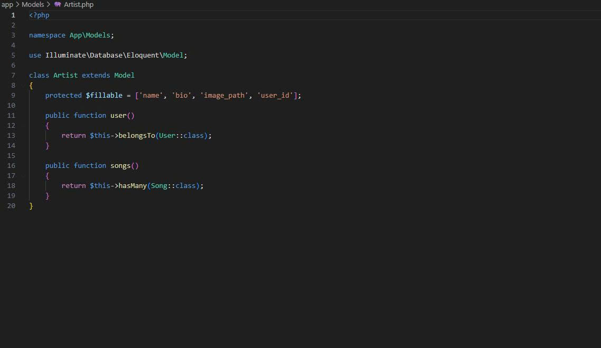
###  4.4.Web.php
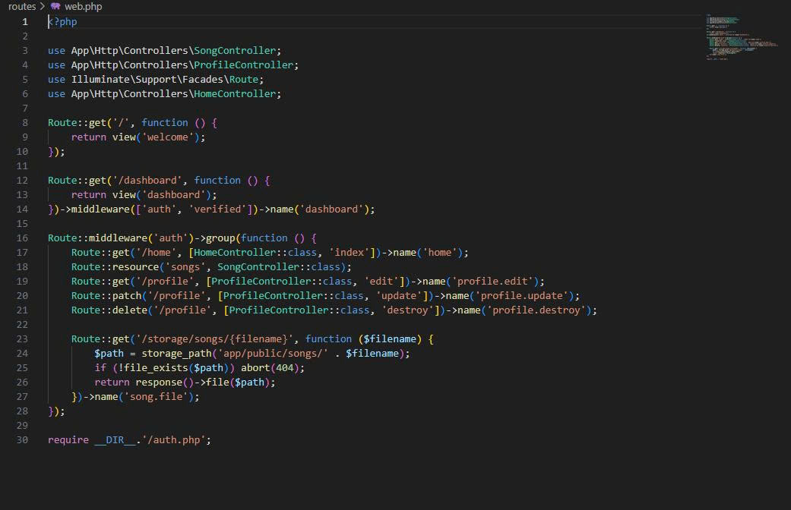
###  4.5.index.php
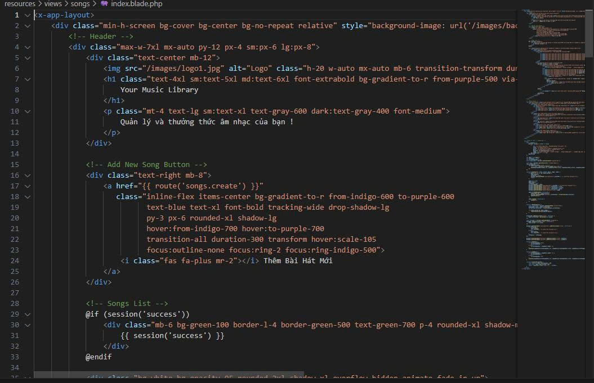
###  4.6.2025_06_01_151609_create_songs_table.php
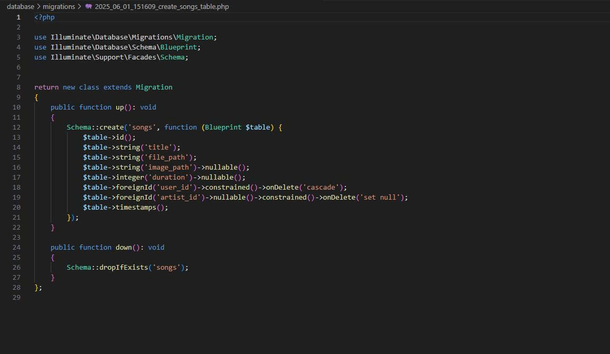
###   4.7.SongController.php
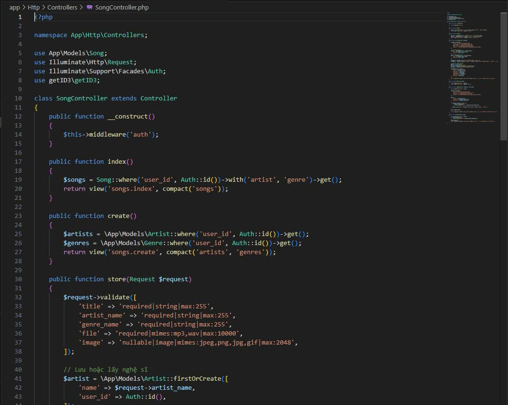
## Link GitHub Repo
 https://github.com/phamductai12425/WebMusic.git
##  Link chạy web (Public)
 https://webmusic-wlns.onrender.com
